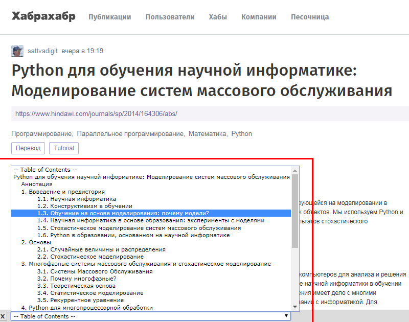

# TOCit!

A bookmarklet that displays a table of contents.



## Installation

- Drag the following link into your bookmarks bar: [TOCit!](javascript:(function(){function%20loadScript(a){var%20c=document.createElement('script');c.type='text/javascript';c.src=a;var%20d=document.getElementsByTagName('head')[0];d.appendChild(c)}loadScript('https://earshinov.github.io/tocit/tocit.js')})();)

- Alternatively, manually add a bookmark with an arbitrary title (preferable "TOCit!") and with the following code as the link address (URL):

```
javascript:(function(){function%20loadScript(a){var%20c=document.createElement('script');c.type='text/javascript';c.src=a;var%20d=document.getElementsByTagName('head')[0];d.appendChild(c)}loadScript('https://earshinov.github.io/tocit/tocit.js')})();
```

## Usage

In order to see the table of contents on a page, just keep the page open and activate the bookmark.  If there are any recognisable headings, the table of contents will appear, collapsed by default, at the bottom of page.

Please note that the bookmarket may not work on some pages which impose security restrictions on running third-party scripts.

In most cases, using the bookmarklet requires Internet connection.

## Credit

This is based on Rune Skaug's AutoTOC ([here](http://www.runeskaug.com/greasemonkey/autotoc.user.js), [license](http://creativecommons.org/licenses/by/2.5/)), enhanced to track page scrolling and accordingly update
the item selected in the TOC.
